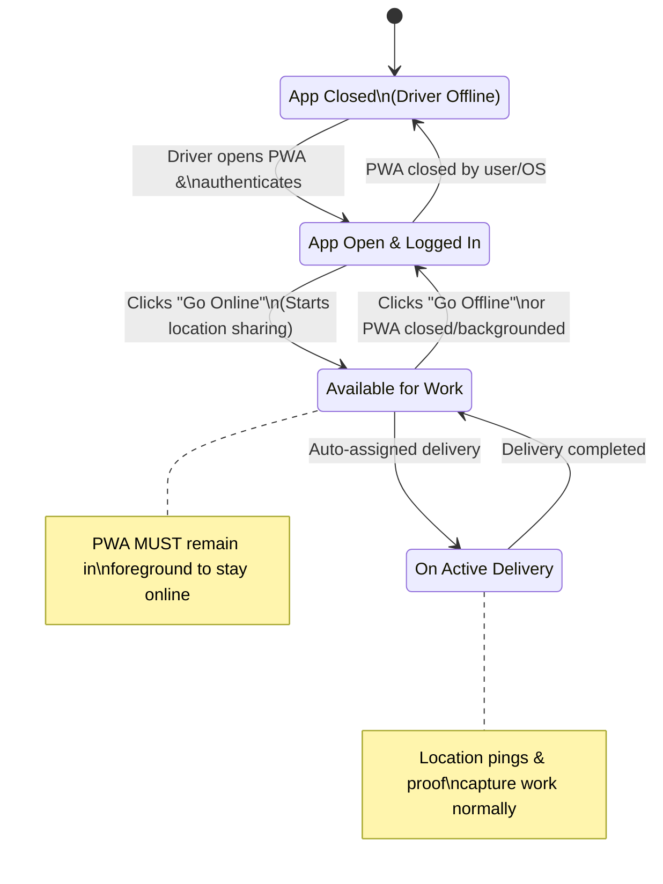

Excellent question. Shifting from a native mobile app to a **Progressive Web App (PWA)** is a significant and potentially advantageous architectural pivot for v1. This requires a formal ADR amendment to assess compatibility with your constraints and goals.

Below is the analysis and amendment to **ADR-013** for this proposed change, following your established format.

---

# ADR-013-A1: Amendment — PWA vs. Native Mobile Application

## Status
**Proposed**

## Date
2026-01-23

## Context
Following the ratification of **ADR-013: Driver Mobile App Contract**, a strategic question arises: should the first-generation driver interface be implemented as a **native mobile application** (iOS/Android) or as a **Progressive Web Application (PWA)**?

A PWA is a web application that uses modern browser capabilities to deliver an app-like experience, including installation to the home screen, offline functionality, and push notifications.

This amendment evaluates the technical and business implications of this choice against the **v1 goals and constraints**.

## Decision
**For v1, implement the driver interface as a Progressive Web App (PWA).**

This decision is driven by **v1's core tenets of simplicity, speed-to-market, and strict constraint adherence**. The PWA's capabilities satisfy all critical v1 requirements while avoiding the complexity of native app development and distribution.

### Technical Evaluation Against ADR-013 Requirements

| Requirement (from ADR-013) | Native App Solution | PWA Solution | Verdict for v1 |
| :--- | :--- | :--- | :--- |
| **Real-Time Communication** | WebSocket libraries (e.g., Socket.IO). | Native WebSocket API + reliable libraries (e.g., Socket.IO client). | ✅ **Feasible**. No gap. |
| **Authentication (JWT)** | Store token in secure storage. | Store token in `IndexedDB` or `localStorage` (with HTTPS). | ✅ **Feasible**. Adequate for v1 security model. |
| **Location Updates (Background)** | Robust background location services. | **Limited**. Requires app to be **foreground/active**. Major v1 constraint. | ⚠️ **Gap. Defines a key v1 limitation.** |
| **Camera Access (Proof)** | Full camera API access. | Full camera API via `getUserMedia`. | ✅ **Feasible**. |
| **Image Upload** | Standard HTTP client. | Standard `fetch` or `axios`. | ✅ **Feasible**. |
| **Offline Queue for Events** | Built-in background processing. | Limited to when app is open. Service Workers can help but are complex for WebSockets. | ⚠️ **Gap. Defines a v1 behavior.** |
| **Push Notifications** | Robust native push services. | Standard Push API via browser. Requires user permission. | ✅ **Feasible**. |
| **App Distribution** | App Store review, binary updates. | **URL access**. Instant updates, no store. | ✅ **Major PWA Advantage for v1.** |

### Implications & v1 Adaptations
Choosing a PWA introduces **two critical constraints** that must be formalized as **explicit v1 rules**:

1.  **Location Tracking is Active-Only**: The driver must have the PWA open and active (screen on) for location pings to be sent to the server. This impacts the accuracy of "nearest available driver" calculations if drivers minimize the app.
2.  **State is Volatile**: If the PWA is closed by the OS or user, the WebSocket connection terminates. The driver effectively appears `OFFLINE` to the dispatch system until they reopen the app.

These constraints are **acceptable for v1** because they:
*   Align with **v1's "simplicity over optimization"** principle.
*   Encourage the desired behavior: drivers actively engaged with the app during their shift.
*   Can be mitigated with clear driver onboarding and UI prompts.
*   Create a clean upgrade path to a native app in v2 **if** data shows these constraints harm operations.

### Updated v1 Workflow (PWA-specific)
The core workflow from ADR-013 remains, but with PWA-awareness.

### Non-Functional Advantages for v1
*   **Development Speed & Cost**: Single codebase (HTML/JS) for all platforms vs. separate iOS and Android teams.
*   **Instant Deployment & Updates**: Fixes and features are deployed instantly to a server; all drivers get the update on next app load. **No App Store review delays.**
*   **Lower Friction Onboarding**: Drivers can start immediately via a link or QR code. No download from an app store required.
*   **Foundational**: The PWA's API layer and UI logic will be fully reusable for a future native app built with React Native or similar.

## Consequences

### Positive (v1-Aligned)
*   **Dramatically faster time-to-market** for the first driver fleet.
*   **Simplified deployment and update process**, crucial for early iteration.
*   **Reduced development and maintenance complexity** (one team, one codebase).
*   **Perfectly encapsulates v1's "good enough" operational model.**

### Negative (Accepted v1 Trade-offs)
*   **Battery & Data Usage**: Keeping the app **foreground and screen-on** for a full shift is impractical. This is the primary operational concession.
*   **Background Reliability**: A phone call or switching apps will pause location updates and may terminate the connection, causing missed assignments or stale status.
*   **Platform Limitations**: Access to advanced device features (e.g., precise battery-optimized background location, Bluetooth) is limited or unavailable.

## Summary & Recommended Path
> **For v1, adopt a PWA. It satisfies all functional requirements while imposing constraints that are congruent with a launch-minimum product. The significant gains in development speed and deployment agility far outweigh the limitations for an initial, constrained delivery fleet.**

The PWA approach **fully complies with ADR-013's contract** (WebSocket, JWT, events). It simply **redefines the client's capabilities**, which is a v1-acceptable trade-off.

**Next Step**: Update the **ADR-013 Driver Mobile App Contract** document to specify the client as a **"Driver PWA (Progressive Web App)"** and add a section detailing the **PWA-specific constraints** listed above. The OpenAPI/AsyncAPI contracts remain valid and unchanged.

Would you like me to draft the specific amendments to the ADR-013 document to reflect this PWA decision formally?