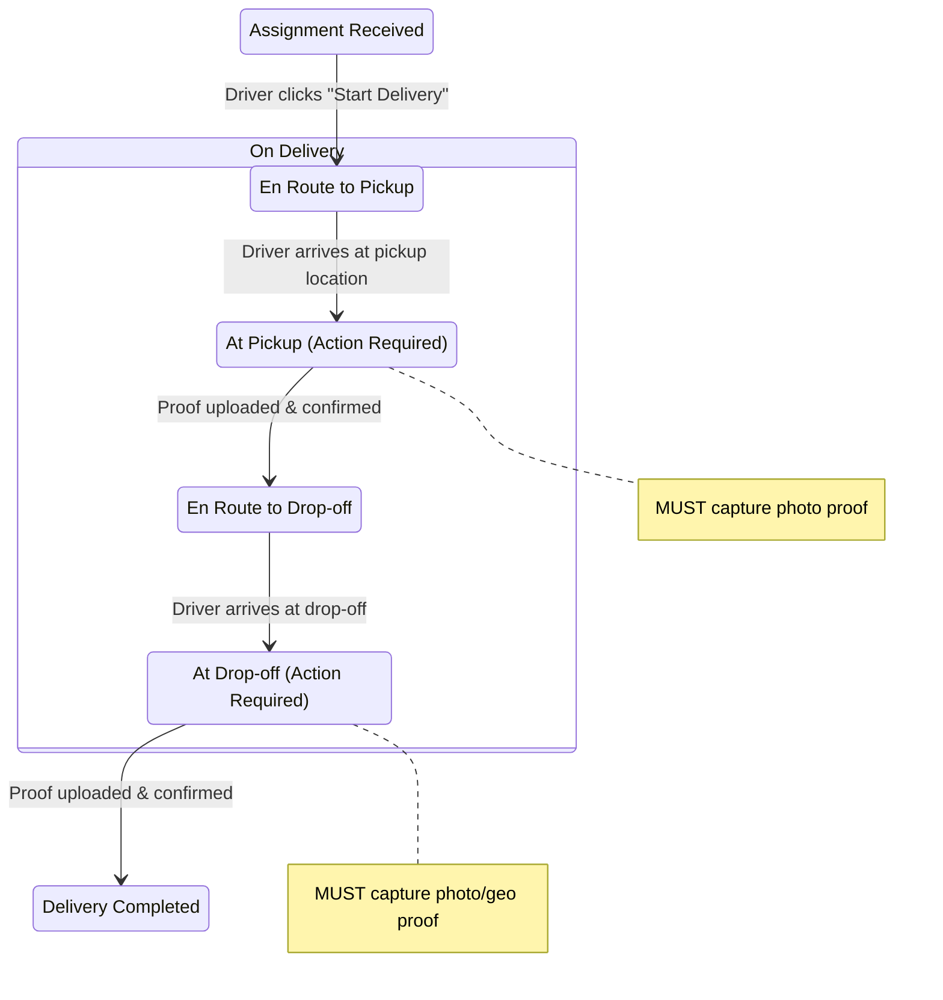

Excellent question. This gets to the **core user experience and operational logic** of the driver's workday. Your state diagram is a perfect, simplified starting point. Based on your ADR principles (especially **simplicity over automation** and **PWA constraints**), here are key architectural opinions and refinements.

### 1. **Refine the "On Delivery" State (The Most Critical Phase)**
The `On Delivery` state is a major phase that needs substates. This isn't adding complexity; it's defining clear, mandatory steps for the driver and the system to ensure the v1 proof-of-fulfillment rules (ADR-009) are followed.

**Proposed Detailed Sub-flow for `On Delivery`:**

**Why this matters:**
*   **Enforces the "Proof Mandate"**: It bakes ADR-009's proof requirements into the UI flow. The driver cannot progress without completing the action.
*   **Creates Clear Audit Triggers**: Each state transition (`ARRIVED_AT_PICKUP`, `PICKUP_CONFIRMED`) is a potential event for logging or notifications (to seller/customer), providing operational visibility.
*   **Defines "Active Location" Scope**: In your PWA, precise location tracking is most critical during `En Route to...` states for navigation. You can relax the frequency (saving battery) during other states.

### 2. **Navigation Strategy: Embed vs. Launch (A PWA-Specific Decision)**
This is a major UX choice. Given v1's PWA constraint, I strongly recommend **the "Launch" strategy**.

| Strategy | How it Works | Pros for v1 | Cons for v1 |
| :--- | :--- | :--- | :--- |
| **Embed (Complex)** | Integrate maps (e.g., Mapbox GL JS) directly into the PWA. | Seamless in-app experience. | Heavy JavaScript bundle, complex state management, significant dev cost. |
| **Launch (Recommended)** | Use `https://www.google.com/maps/dir/?api=1&destination=<lat>,<lng>` to open Google/Apple Maps. | **Leverages the device's best-in-class navigation app.** Zero dev cost for turn-by-turn. Driver can switch back to PWA for task completion. | Context switch between apps. Requires the PWA to pass coordinates correctly. |

**V1 Recommendation:** Use **Launch**. It's perfectly aligned with the "do less, but do it correctly" v1 philosophy. The driver's primary task is navigation; let the dedicated, battery-optimized native app handle it. Your PWA's job is to manage the **workflow and proof capture**, not the map rendering.

### 3. **The "Location Heartbeat" & Background Reality**
Your note about active location sharing is correct. With a PWA, you must design for the **foreground reality**.

**Practical Implementation Advice:**
1.  **Use the Geolocation API** with `{ enableHighAccuracy: true }` when the state is `En Route to...`.
2.  **Throttle Updates**: Send `LOCATION_UPDATE` to your server every 20-30 seconds, not continuously. This balances accuracy with battery/data use.
3.  **Implement a Visibility Listener**: Use the Page Visibility API to detect when the driver switches tabs/apps and **pause your location watcher**. Log this as a `DRIVER_PAUSED` event. When the PWA is visible again, restart the watcher and send a `DRIVER_RESUMED` event.
4.  **State Integrity**: If the PWA is in the background for too long (e.g., >2 minutes), automatically transition the driver's status from `En Route to Pickup` to a `PAUSED` state. This prevents the system from assuming a stalled delivery.

### 4. **Add an Explicit "Paused" State**
The real world interrupts deliveries. Adding a `PAUSED` state (accessible from `En Route to...` states) is crucial.
*   **Triggered by**: Driver action ("Take a break"), PWA backgrounding, or loss of network.
*   **Behavior**: Stops location pings, timer pauses. The delivery is **not failed**, just on hold.
*   **Why it's v1-appropriate**: It handles a real-world case without complex logic (like dynamic ETAs). It's a simple, honest state.

### **Summary of Actionable Recommendations:**

1.  **Refine the "On Delivery" Monolith** into the four substates (`En Route to Pickup`, `At Pickup`, `En Route to Drop-off`, `At Drop-off`) to enforce proof capture and create audit points.
2.  **Choose "Launch" for Navigation**. Open Google/Apple Maps via URL. Do not build maps into the v1 PWA.
3.  **Design for the Foreground PWA**. Implement smart location throttling and use the Page Visibility API to manage state integrity when the app is backgrounded.
4.  **Introduce a "Paused" State**. This simple addition gracefully handles breaks and app backgrounding, aligning with v1's operational honesty.

These suggestions are not scope creep; they are the **minimal, necessary concretions** of your existing ADRs to build a workable, v1-compliant driver PWA. They provide a solid, logical foundation that can be built upon in v2 without refactoring.

Would you like to evolve the ADR-013 contract to incorporate any of these specific state or behavioral definitions?