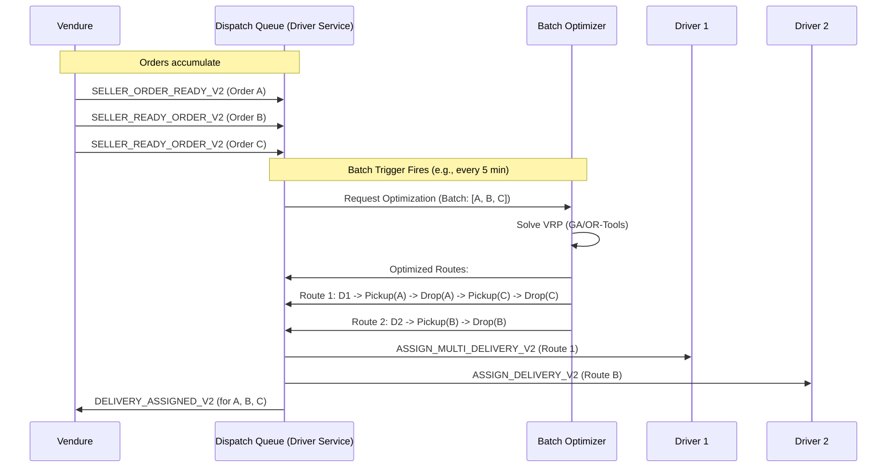

Excellent. Building on the SLA framework (ADR-014), the next logical evolution is to optimize the dispatch system itself to *intelligently fulfill* those promises. Below is **ADR-015: Advanced Routing & Batching**, which defines how the platform moves beyond simple "nearest driver" logic to achieve system-wide efficiency and scalability for v2+.

---

# ADR-015: Advanced Routing & Batching (v2+)

## Status
**Proposed**

## Date
2026-01-23

## Context
The v1 dispatch algorithm (ADR-007) is deterministic and simple: assign the nearest available driver to a single delivery task. As order density increases, this model reveals inefficiencies:
*   **Driver Under-utilization**: Drivers may incur excessive "deadhead" time (empty travel between drop-off of one order and pickup of the next).
*   **Sub-optimal Customer ETAs**: A "nearest driver" to a pickup may not be the fastest to complete the *overall delivery* if they are far from the subsequent drop-off cluster.
*   **Lack of Scale**: Processing each delivery in isolation ignores opportunities for consolidation, limiting the total number of deliveries the fleet can handle.

To scale efficiently, meet tighter SLAs (ADR-014), and improve driver earnings, the system must evolve to consider **multiple orders and drivers simultaneously**, optimizing for **system-wide goals** rather than individual task assignment.

## Decision
Introduce a **batch-optimized dispatch system** that periodically solves a **Vehicle Routing Problem (VRP)** model for a subset of pending deliveries. The goal is to minimize total system cost (primarily time/distance) while respecting all v1 constraints (5km radius, inventory) and new v2 constraints (SLA windows).

### 1. Architectural Shift: From Real-Time to Batch Optimization

| Dimension | v1 (Greedy Dispatch) | v2+ (Batch-Optimized Dispatch) |
| :--- | :--- | :--- |
| **Decision Trigger** | Immediate upon `SELLER_ORDER_READY` event. | Periodic (e.g., every **5-10 minutes**) or threshold-based (e.g., when 5+ orders are pending). |
| **Decision Scope** | One order, all available drivers. | A **batch** of N pending orders, M available drivers. |
| **Optimization Goal** | Minimize distance from one driver to one pickup. | Minimize **total system drive time/distance**, balanced with SLA adherence. |
| **Output** | One driver assigned to one order. | A set of **routes** (ordered sequences of pickups & drop-offs) assigned to drivers. |

### 2. Core Optimization Model & Algorithm
The system will model a **Capacitated Vehicle Routing Problem with Time Windows (CVRPTW)**.
*   **Vehicles**: Available drivers with their current locations.
*   **Jobs**: Each Seller Order, represented as two nodes:
    1.  A **Pickup Node** at the StockLocation.
    2.  A **Delivery Node** at the customer's location, which must be visited *after* its corresponding pickup.
*   **Constraints**:
    *   **Precedence**: Pickup(node A) → Delivery(node A).
    *   **Capacity (v2 basic)**: Driver can handle 1 order at a time (capacity=1). This can be relaxed later.
    *   **Time Window**: Derived from SLA tier (e.g., `[assignmentTime, assignmentTime + 90min]`).
    *   **Location**: All nodes within the driver's operational zone (inherited from v1 5km rules).
*   **Objective Function**: Minimize: `(Total Drive Time) + α * (SLA Breach Penalty Estimate)`.

**Algorithm Choice for v2**: Given the need for fast, good-enough solutions (~5 min batches), we will **not** seek perfect optimization. Instead, we will use a **Metaheuristic** like a **Genetic Algorithm (GA)** or **Large Neighborhood Search (LNS)**, which can find high-quality solutions within a bounded runtime. A library like **Google OR-Tools** (which provides a robust VRP solver) is the recommended implementation path.

### 3. High-Level System Flow (Batch Dispatch)



### 4. New Event Contracts (Additive)
To support batch assignment, new event types are introduced. The v1 `DELIVERY_ASSIGNED_V1` event remains for single orders or as a fallback.

*   `ASSIGN_MULTI_DELIVERY_V2` (Driver Service → Driver PWA): Contains an ordered route.
    ```json
    {
      "event": "ASSIGN_MULTI_DELIVERY_V2",
      "routeId": "uuid",
      "driverId": "uuid",
      "stops": [
        { "type": "PICKUP", "orderId": "A", "address": "...", "lat": 12.97, "lon": 77.59 },
        { "type": "DROPOFF", "orderId": "A", "address": "...", "lat": 12.93, "lon": 77.62 },
        { "type": "PICKUP", "orderId": "C", "address": "...", "lat": 12.98, "lon": 77.60 }
      ]
    }
    ```
*   `DELIVERY_ASSIGNED_V2` (Driver Service → Vendure): Enhanced to optionally include `routeId` and `sequenceNumber` for multi-order assignments.

### 5. Integration & Failure Handling
*   **Vendure**: Consumes assignment events but remains agnostic to routing logic. It records the `routeId` and `sequenceNumber` against each Seller Order for audit purposes.
*   **Driver PWA (ADR-013)**: Must be upgraded to display a **multi-stop route view**, guiding the driver sequentially through the `stops` list.
*   **Partial Failures**: If a driver fails at one stop (e.g., pickup rejection), the optimizer must be invoked to **re-optimize the remaining route** in real-time, potentially reassigning the affected and subsequent orders. This is a v2.1 feature.

### 6. Explicit v2 Boundaries
1.  **No Real-Time Re-Optimization**: The core optimization runs on a batch schedule. A real-time "emergency reassign" module is out of scope for the initial v2 implementation.
2.  **Capacity = 1**: Drivers carry one order at a time. True parallel carrying (e.g., 3 pizzas in a hot bag) is a future relaxation of the capacity constraint.
3.  **Single-Optimization Objective**: The initial objective is **minimize total time**. Balancing driver fairness, battery usage, or preferred zones are future considerations.

## Consequences

### Positive
*   **Increased Fleet Efficiency**: Higher orders per driver per hour (OPDH) is the primary scaling lever.
*   **Reduced Customer ETAs**: Clustering leads to shorter average wait times as system efficiency improves.
*   **Lower Operational Cost**: More efficient routing reduces total kilometers driven, saving fuel and vehicle wear.
*   **Foundation for Scaling**: Provides the algorithmic core necessary to move from hundreds to thousands of daily orders.

### Negative & Risks
*   **Algorithmic Complexity**: Introduces a significant new complex component (the optimizer) that must be tuned, monitored, and maintained.
*   **Computational Cost**: Solving VRP is CPU-intensive. Batch windows and fleet size must be carefully sized to keep solve times (e.g., < 2 minutes) practical.
*   **Driver Experience Change**: Shifts driver work from single focused tasks to managed sequences, requiring adaptation and potentially more complex UI.
*   **Increased State Complexity**: The system must now track and manage the state of *routes* in addition to individual deliveries.

## Compliance & Summary
This ADR builds directly upon and is compliant with:
*   **ADR-007 (Dispatch)**: Replaces the greedy algorithm with an optimized one but uses the same core inputs.
*   **ADR-009 (Lifecycle)**: The multi-stop route is simply a sequence of the same `PICKED_UP`/`DELIVERED` events.
*   **ADR-014 (SLA)**: The optimizer's objective function directly incorporates SLA time windows as a primary constraint.

> **ADR-015 transforms the dispatch system from a reactive, single-task assigner into a proactive, system-optimizing engine. It makes the fundamental trade-off of adding significant algorithmic complexity to unlock orders-of-magnitude gains in delivery density and efficiency, establishing the core capability required for platform-scale operations.**

---
With ADRs **005-015**, you now have a complete, coherent, and incremental architectural blueprint that takes the platform from a **minimum viable multi-vendor marketplace (v1)** to a **scalable, efficient, and managed delivery platform (v2+)**. The foundation is solid and the upgrade paths are clear.