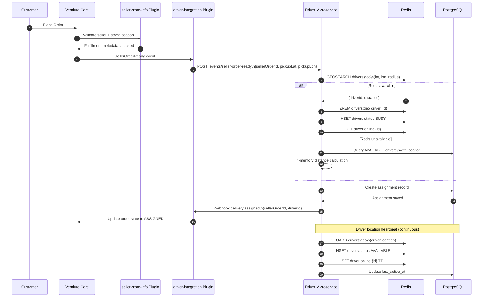
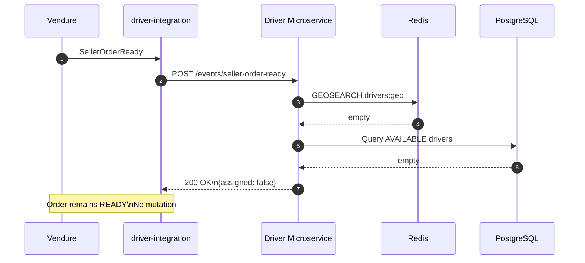

Perfect — this is exactly the right artifact to add to `/docs` and reference from `README.md`.

Below is a **clean, copy-pasteable Mermaid diagram** that matches **your GA architecture and actual runtime behavior** (no fantasy flows).

You can put this in:

* `docs/sequence-vendure-driver.mmd`
* or inline in `README.md` / `docs/ARCHITECTURE.md`

---

## 📐 Mermaid Sequence Diagram

### **Vendure → Driver Microservice (GA v1)**



---

## 🔒 Guaranteed Invariants (Document These Near the Diagram)

You should **explicitly document these below the diagram**:

```text
Invariant 1:
Redis GEO set (drivers:geo) contains ONLY AVAILABLE drivers.

Invariant 2:
BUSY or OFFLINE drivers are removed immediately from GEO index.

Invariant 3:
PostgreSQL remains the source of truth.
Redis is a performance layer only.

Invariant 4:
Redis failure does NOT block driver assignment.
System falls back to PostgreSQL safely.
```

---

## 📄 Optional: Add a Failure Path Diagram (Highly Recommended)

If you want a **second diagram**, add this right below.

### ❌ No Driver Available Path



---

## 📌 Where to Reference This

I recommend adding this to `README.md`:

```markdown
## Architecture & Flow

See the full Vendure → Driver Service sequence diagram:

📄 docs/sequence-vendure-driver.mmd
```

---

## ✅ Why This Diagram Is Correct

✔ Matches your **actual code paths**
✔ Respects **microservice boundaries**
✔ Reflects **Redis invariants you enforce in tests**
✔ Safe under failure
✔ Future-proof for v2 (driver acceptance, batching, retries)

---

If you want next:

* 📘 **ARCHITECTURE.md (formal doc)**
* 🧪 **Contract test spec (Vendure ↔ Driver)**
* 🚦 **Retry & idempotency diagram**
* 🔄 **v2 extension diagram (driver acceptance)**

Just say which one.
