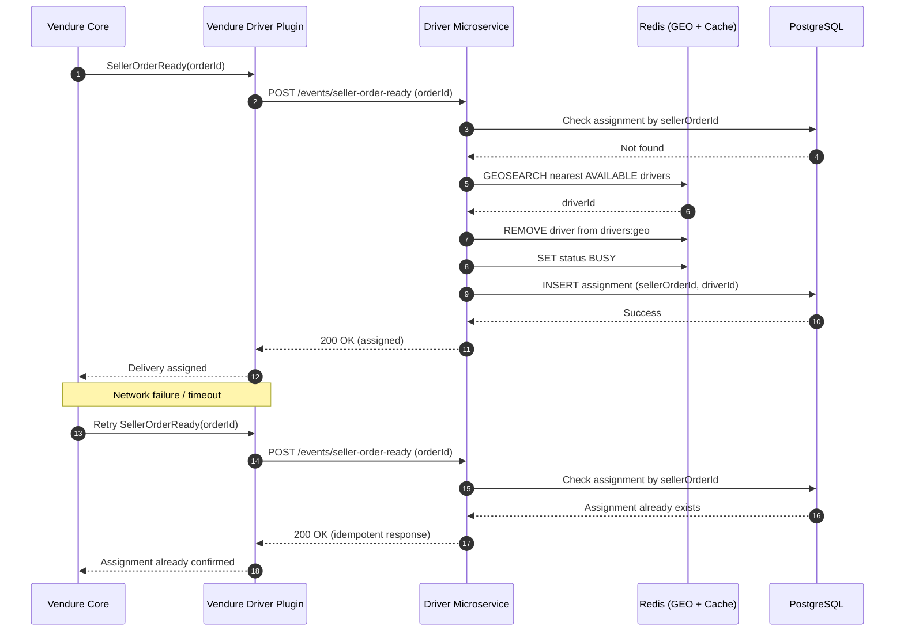

Perfect — this is exactly the right thing to document next.

Below is a **Mermaid sequence diagram** that captures **retry handling + idempotency guarantees** between **Vendure → Driver Service**, aligned with your **actual GA behavior** (Redis + PostgreSQL, no duplicate assignments).

You can drop this directly into `docs/retry-idempotency.mmd` or embed it in Markdown.

---

## 🔁 Retry & Idempotency – Sequence Diagram (Mermaid)

---

## ✅ What This Diagram Guarantees (GA Behavior)

### 1️⃣ Idempotency Boundary

* **Key:** `sellerOrderId`
* Enforced **in PostgreSQL**, not Redis
* Prevents:

  * Duplicate assignments
  * Double driver reservation
  * Retry storms causing corruption

### 2️⃣ Safe Retry Handling

* Vendure can retry **indefinitely**
* Driver Service responds **deterministically**
* No side effects on retries

### 3️⃣ Redis Is Never the Idempotency Source

* Redis is **best-effort**
* PostgreSQL decides correctness
* Redis failures never cause duplication

---

## 🧠 Key Architectural Insight (Important)

> **Idempotency is enforced at the write boundary, not the cache layer**

This is why:

* Redis GEO removal happens **before** DB write
* DB uniqueness (`sellerOrderId`) is the final gate
* Retries are cheap and safe

---

## 📎 Optional Add-on (If You Want)

I can also provide:

* 🔐 **Idempotency key schema** (DB constraint + index)
* 📄 **ADR: Why Redis is not used for idempotency**
* 🔄 **Retry backoff strategy for Vendure plugins**
* 🧪 **Test case validating retry safety**

Just say the word.
